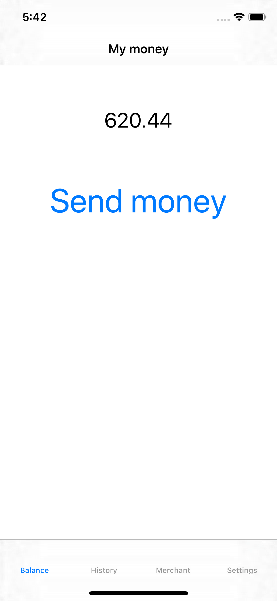
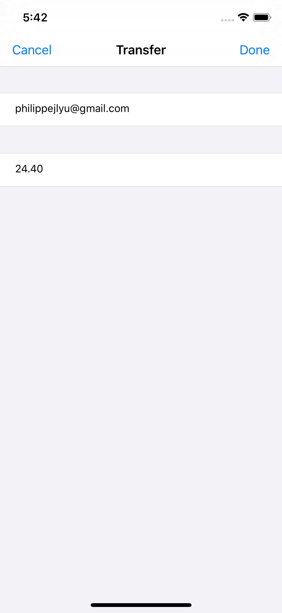
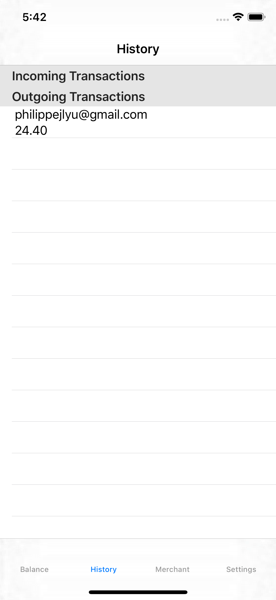

# Money Transfer
## Running instructions
Clone https://github.com/philippejlyu/MoneyTransfer-Backend

If you haven't already, run pip install flask

Run endpoints.py

Then in ServerInteractor.swift, change the apiURL to be the url given by
flask.

## Screenshots

